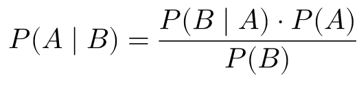
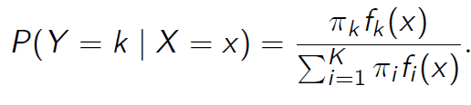
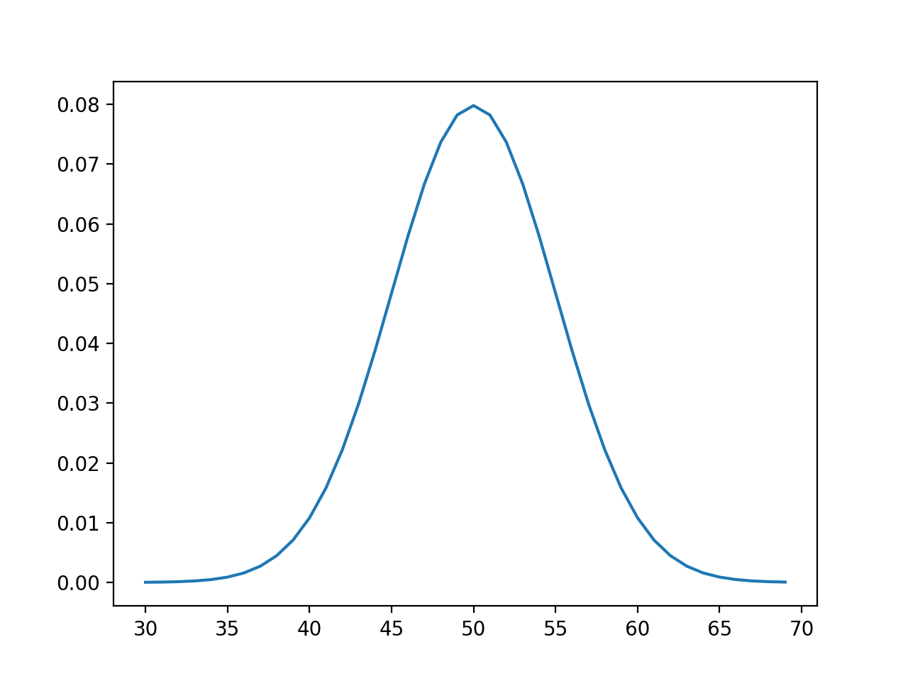
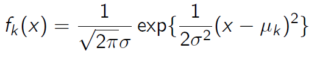

# What is LDA?

LDA stands for Linear Discriminant Analysis and is a type of classification algorithm. It is based on bayes theorem and distribution of data. The fundamental difference between LDA and Logistic regression is that Logistic regression directly models the probability of a data point being in a certain class: 
**P(y=k|X=x)**  
whereas the LDA classifier tries to find this probability using the Bayes theorem

# LDA Classifier
Before moving on let us revisit the Baye's Theorem

Now we will see a restructured version of this to suit our task of classification

The left hand side of this formula is interpreted as: Probability of a data point being in class k if its features are x. It will be refered to using Pk(x). 
Lets break down the right hand side and compare it with the original Bayes Theorem
* πk corresponds to P(A) which is the probability of occurence of class k in your data.
* fk(x) is the probability of occurence of x in class k. To find this we need to know the distribution of the data.
* The denominator of course corresponds to P(B). As the features x may not be unique to just class k and occur in any of the classes,
  it is denoted by a weighted sum as shown.

The task at hand is to find fk(x) or the distribution of data in your dataset which can also tell the probability. We shall proceed with the assumption that it is a normal distribution. Lets see what a normal distribution looks like.
**Lets assume that there is only one feature and based on that we are doing the classification**. So if the values in the feature were to be distributed normally and normalised, it would look like

The equation is:

* μk is the average of all x belonging to class k
* σ2k is the variance of all x belonging to class k. **The assumption of LDA is that the variance of all classes is equal and so we can refer to it as just σ2**
After knowing all these values, we need to plug it into Pk(x) and find its value for each k. The class corresponding to the highest value is the class to which this particular datapoint belongs to.
